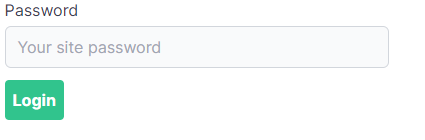

One way to add simple password protection for a Next.js site. Designed for scenarios where you want to publish something and restrict access with a password on a free-tier deployment.

> Using this will opt your pages out of automatic static optimization!

Visit:

- Public: https://next-password-protect-sample.vercel.app/
- Protected: https://next-password-protect-sample.vercel.app/protected

Password is 'letmein' (see `_app.js`).

